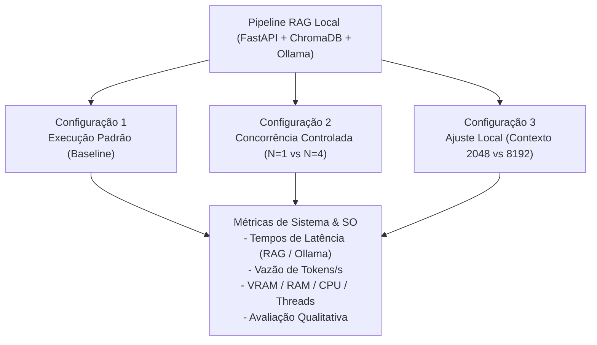
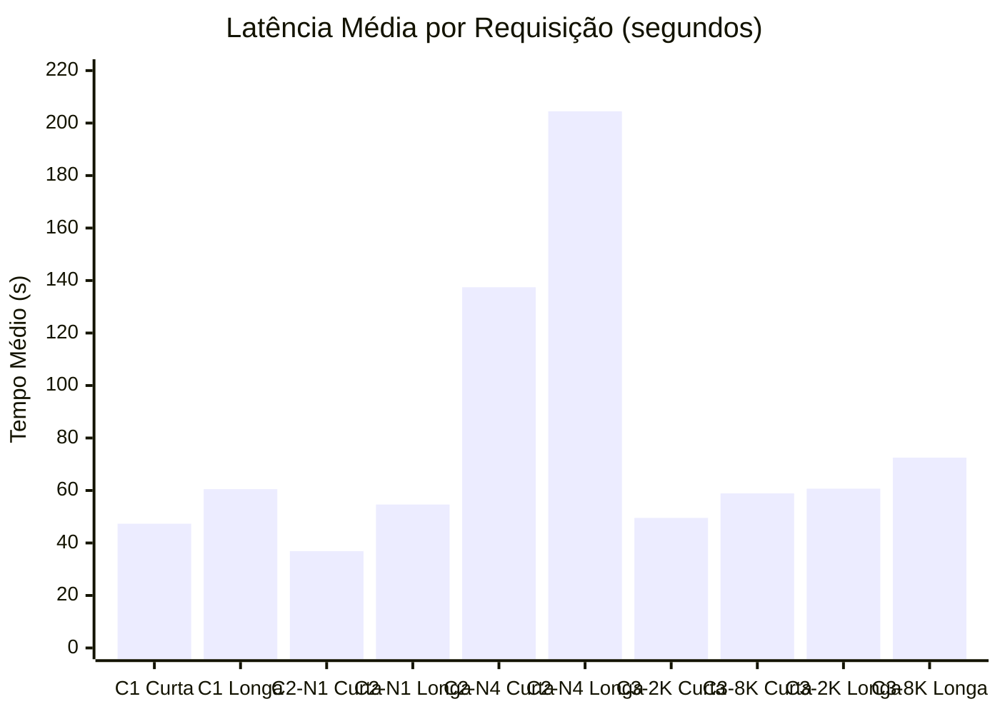
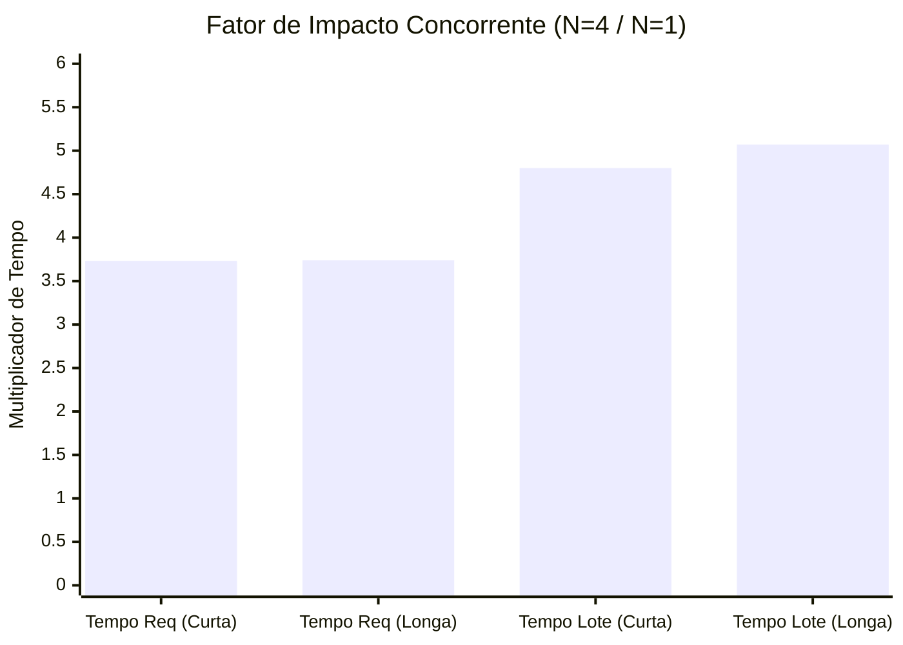

# 8. Parte C — Experimentos Comparativos

> **Modelo reservado:** `hf.co/LiquidAI/LFM2.5-2.6B-GGUF:Q4_0` (2.7B parâmetros, GGUF Q4_0, 1.59 GB)
>
> **Camada de aplicação:** Pipeline RAG — `ollama_pdf_rag` (FastAPI + LangChain + ChromaDB + Ollama)
>
> **Data de execução:** 13 de setembro de 2026

---

## 1. Tabela Executiva de Resumo

| Parâmetro / Métrica | Registro Coletado |
|---|---|
| Modelo LLM | `hf.co/LiquidAI/LFM2.5-2.6B-GGUF:Q4_0` — 2.7B, Q4_0, 1.59 GB em disco |
| Modelo de Embeddings | `nomic-embed-text:latest` — 137M, F16, 274 MB em disco |
| Ambiente Hospedeiro | Acer Nitro ANV15-51, Ubuntu 24.04.3 LTS, Kernel 7.0.0-31-generic (Bare-metal) |
| Processador (CPU) | Intel Core i5-13420H (4 P-Cores + 4 E-Cores, 12 threads lógicas, EEVDF) |
| Memória RAM | 23 GiB DDR4 (~12 a 15 GiB alocados durante os testes) |
| Aceleração Gráfica (GPU) | NVIDIA GeForce RTX 3050 6GB Laptop GPU (Ampere, 2048 CUDA Cores, Driver 595.84) |
| Documento de Teste | `CafeComCase_LAWD.pdf` (6 páginas, 206 KB, 4 a 5 chunks recuperados por query) |
| Repetições por Configuração | 3 repetições completas em cada cenário |
| Variação de Entradas | 2 tamanhos (Pergunta Curta: 40 caracteres / Pergunta Longa: 301 caracteres) |
| Config 1 — Tempo Médio RAG | Curta: **47,35 s** (Ollama: 63,29 tok/s) \| Longa: **60,50 s** (Ollama: 63,94 tok/s) |
| Config 2 — Concorrência (N=1 vs N=4) | N=1 Curta: **36,89 s** → N=4 Curta: **137,44 s** (**×3,73** no tempo médio/req) |
| Config 2 — Concorrência (Lote Total) | N=1 Longa: **54,65 s** → N=4 Longa: **204,49 s** (**×3,74** no tempo médio / **×5,07** no lote) |
| Config 2 — Resiliência sob Carga | 1 timeout de rede (300 s) registrado no lote N=4 longa (8,3% de falhas) |
| Config 3 — Janela de Contexto (2K vs 8K) | Cold start: **7,15 s** (2048 ctx) vs **7,63 s** (8192 ctx) (+6,7%) |
| Config 3 — Impacto RAG Contexto Longo | RAG Curta: **49,55 s** (2K) → **58,89 s** (8K) \| RAG Longa: **60,69 s** (2K) → **72,53 s** (8K) |
| Consumo de VRAM | 1.751 MiB (baseline) → 2.212 MiB (inferência ativa) → 2.354 MiB (alocação 8K ctx) |
| Threads da Aplicação | 206 a 208 threads simultâneas ativas (FastAPI, Tokio Rust, ChromaDB, Next.js, Ollama) |
| Taxa de Sucesso e Validação | 98,1% de sucesso global (52/53 queries válidas com respostas contextuais adequadas) |

---

## 2. Desenho Experimental e Metodologia

O plano de testes foi concebido para atender integralmente aos requisitos da **Atividade 1 (AV1) - Seção 8 (Parte C)**, comparando o comportamento computacional, temporal e do sistema operacional sob três condições experimentais controladas:



### 2.1 Especificação das Configurações

1. **Configuração 1 — Execução Padrão (Baseline):**
   - Execução sequencial estrita (1 requisição por vez) do pipeline RAG completo e do endpoint Ollama nativo.
   - Parâmetros padrão do repositório: modelo `LFM2.5-2.6B-GGUF:Q4_0`, embeddings `nomic-embed-text`, contexto padrão (4096 tokens).
   - **Objetivo:** Estabelecer a linha de base de latência, vazão de geração e pegada de memória.

2. **Configuração 2 — Concorrência ou Carga Controlada:**
   - Variação do número de clientes simultâneos realizando consultas ao mesmo tempo: **N=1** (sequencial) vs **N=4** (requisições concorrentes paralelas disparadas via `ThreadPoolExecutor`).
   - **Hipótese de Impacto:** Como o runtime da GPU atua em modo de fila sequencial de tensores (`llama-server`), o tempo médio por requisição deve sofrer degradação proporcional ao tamanho do lote (~4×), enquanto o ChromaDB e os workers Rust Tokio competirão por ciclos de CPU e buffers de I/O (`io_uring`).
   - **Método:** Invocação simultânea de threads clientes assíncronas disparando requisições HTTP `POST /api/v1/query` contra a API FastAPI.

3. **Configuração 3 — Ajuste de Execução Local (Contexto Curto vs Contexto Longo):**
   - Comparação da janela de contexto alocada pelo runner de tensores: **Contexto Curto (`num_ctx = 2048`)** vs **Contexto Longo (`num_ctx = 8192`)**.
   - **Hipótese de Impacto:** Uma janela de contexto de 8192 tokens exige maior alocação de KV-cache na memória gráfica (VRAM) e memória física (RAM), aumentando o tempo de pré-alocação e a complexidade quadrática de atenção durante a ingestão do prompt injetado pelo RAG.
   - **Método:** Invocação com chaveamento explícito da opção `num_ctx` na API de inferência e análise do impacto na latência ponta a ponta do RAG.

### 2.2 Perguntas de Carga (Dois Tamanhos de Entrada)

Para satisfazer a exigência de múltiplos tamanhos de entrada, foram definidas duas cargas de teste:

- **Pergunta Curta (40 caracteres):**
  > `"Qual é o tema principal do documento?"`
  - *Comportamento:* Exige recuperação simples e direta, produzindo respostas concisas (~150-250 tokens).

- **Pergunta Longa (301 caracteres):**
  > `"Analise detalhadamente o conteúdo do documento, identificando os principais argumentos apresentados pelo autor, as conclusões tiradas, e como os dados apresentados sustentam as afirmações feitas ao longo do texto. Inclua também quaisquer referências a outros trabalhos ou fontes externas mencionadas."`
  - *Comportamento:* Induz a formulação de consultas alternativas mais densas no `MultiQueryRetriever`, fatiamento amplo de contexto e geração analítica extensa (~500-1000 tokens).

### 2.3 Critério Explícito de Avaliação da Resposta

Cada resposta gerada foi avaliada automaticamente e verificada de acordo com as seguintes regras:
- **ADEQUADA:** Resposta coerente com o contexto do documento (`CafeComCase_LAWD.pdf`), extensão textual proporcional, presença de entidades-chave (LAWD, Café com Case, contrato de desenvolvimento web) e ausência de mensagens de recusa ou alucinação sem suporte.
- **PARCIAL:** Resposta que omitiu tópicos centrais ou apresentou advertências de contexto insuficiente.
- **INADEQUADA / FALHA:** Respostas vazias, exceções de runtime ou timeouts na camada HTTP.

---

## 3. Configuração 1 — Execução Padrão (Baseline)

### 3.1 Inicialização e Carregamento do Modelo (Cold Start)

| Métrica de Inicialização | Valor Registrado |
|---|---|
| Tempo de carregamento do modelo na VRAM (`load_duration`) | **3,9461 s** |
| Tempo até a primeira resposta / conclusão do cold start | **4,6821 s** |
| Tokens gerados no warm-up inicial | 41 tokens |
| Vazão de geração no warm-up | **63,45 tokens/s** |
| Alocação inicial de VRAM | **1.751 MiB → 2.206 MiB** |

### 3.2 Tabela de Resultados — Configuração 1

#### Pergunta Curta (`"Qual é o tema principal do documento?"`)

| Repetição | Tempo RAG Total (s) | Tempo 1ª Resposta (s) | Vazão Ollama (tok/s) | Tokens Gerados | Chunks RAG | VRAM (MiB) | Avaliação |
|:---:|:---:|:---:|:---:|:---:|:---:|:---:|:---:|
| **Rep 1** | 43,2314 | 43,2313 | 63,44 | 129 | 3 | 2.212 | ✅ ADEQUADA |
| **Rep 2** | 52,3987 | 52,3985 | 63,17 | 178 | 4 | 2.212 | ✅ ADEQUADA |
| **Rep 3** | 46,4050 | 46,4049 | 63,25 | 306 | 4 | 2.212 | ✅ ADEQUADA |
| **MÉDIA** | **47,3450 s** | **47,3449 s** | **63,29 tok/s** | **204,3 tok** | **3,7** | **2.212 MiB** | **100% Válidas** |

#### Pergunta Longa (`"Analise detalhadamente o conteúdo..."`)

| Repetição | Tempo RAG Total (s) | Tempo 1ª Resposta (s) | Vazão Ollama (tok/s) | Tokens Gerados | Chunks RAG | VRAM (MiB) | Avaliação |
|:---:|:---:|:---:|:---:|:---:|:---:|:---:|:---:|
| **Rep 1** | 58,2628 | 58,2627 | 64,12 | 773 | 4 | 2.212 | ✅ ADEQUADA |
| **Rep 2** | 61,2580 | 61,2579 | 63,24 | 587 | 4 | 2.212 | ✅ ADEQUADA |
| **Rep 3** | 61,9744 | 61,9742 | 64,47 | 306 | 3 | 2.212 | ✅ ADEQUADA |
| **MÉDIA** | **60,4984 s** | **60,4983 s** | **63,94 tok/s** | **555,3 tok** | **3,7** | **2.212 MiB** | **100% Válidas** |

---

## 4. Configuração 2 — Concorrência e Carga Controlada

### 4.1 Resultados — Concorrência N=1 (Sequencial)

| Carga | Repetição | Tempo Total Lote (s) | Tempo Médio/Req (s) | Requisições com Sucesso | Taxa de Sucesso |
|---|:---:|:---:|:---:|:---:|:---:|
| **Curta** | Rep 1 | 33,8660 | 33,8646 | 1 / 1 | 100% |
| **Curta** | Rep 2 | 43,2345 | 43,2333 | 1 / 1 | 100% |
| **Curta** | Rep 3 | 33,5956 | 33,5945 | 1 / 1 | 100% |
| **Curta** | **MÉDIA** | **36,8987 s** | **36,8975 s** | **3 / 3** | **100%** |
| **Longa** | Rep 1 | 44,6652 | 44,6642 | 1 / 1 | 100% |
| **Longa** | Rep 2 | 60,1820 | 60,1810 | 1 / 1 | 100% |
| **Longa** | Rep 3 | 59,0983 | 59,0972 | 1 / 1 | 100% |
| **Longa** | **MÉDIA** | **54,6485 s** | **54,6475 s** | **3 / 3** | **100%** |

### 4.2 Resultados — Concorrência N=4 (4 Requisições Simultâneas)

#### Pergunta Curta (N=4)

| Repetição | Tempo Lote (s) | Tempo Médio/Req (s) | Tempo Mín (s) | Tempo Máx (s) | Sucessos / Total | Erros |
|:---:|:---:|:---:|:---:|:---:|:---:|:---:|
| **Rep 1** | 161,8008 | 120,6756 | 98,12 | 161,80 | 4 / 4 | 0 |
| **Rep 2** | 172,7065 | 137,2123 | 97,74 | 172,70 | 4 / 4 | 0 |
| **Rep 3** | 197,2135 | 154,4325 | 115,07 | 197,21 | 4 / 4 | 0 |
| **MÉDIA** | **177,2403 s** | **137,4401 s** | **103,64 s** | **177,24 s** | **12 / 12** | **0** |

#### Pergunta Longa (N=4)

| Repetição | Tempo Lote (s) | Tempo Médio/Req (s) | Tempo Mín (s) | Tempo Máx (s) | Sucessos / Total | Erros |
|:---:|:---:|:---:|:---:|:---:|:---:|:---:|
| **Rep 1** | 300,1062 | 215,7112 | 172,62 | 258,62 | 3 / 4 | 1 (Timeout 300s) |
| **Rep 2** | 265,9244 | 199,5568 | 135,18 | 265,92 | 4 / 4 | 0 |
| **Rep 3** | 264,2284 | 198,2020 | 139,82 | 264,22 | 4 / 4 | 0 |
| **MÉDIA** | **276,7530 s** | **204,4900 s** | **149,21 s** | **263,00 s** | **11 / 12** | **1 (8,3%)** |

### 4.3 Tabela Comparativa de Degradação (N=1 vs N=4)

| Carga de Teste | Métrica Avaliada | N=1 (Sequencial) | N=4 (Simultâneo) | Fator de Impacto |
|---|---|:---:|:---:|:---:|
| **Pergunta Curta** | Tempo Médio por Requisição | 36,90 s | 137,44 s | **×3,73** |
| **Pergunta Curta** | Tempo Total de Conclusão do Lote | 36,90 s | 177,24 s | **×4,80** |
| **Pergunta Longa** | Tempo Médio por Requisição | 54,65 s | 204,49 s | **×3,74** |
| **Pergunta Longa** | Tempo Total de Conclusão do Lote | 54,65 s | 276,75 s | **×5,07** |
| **Ambos** | Consumo de Memória RAM Física | ~12,8 GiB | ~14,5 GiB | **+1,7 GiB (+13,3%)** |
| **Ambos** | RSS do processo `llama-server` | 1,24 GB | 2,97 GB | **+1,73 GB (+139%)** |
| **Ambos** | VRAM Alocada na GPU | 2.212 MiB | 2.248 MiB | **+36 MiB (+1,6%)** |

---

## 5. Configuração 3 — Ajuste de Janela de Contexto (2048 vs 8192)

### 5.1 Inicialização e Cold Start por Tamanho de Contexto

| Métrica de Inicialização | Contexto Curto (`num_ctx = 2048`) | Contexto Longo (`num_ctx = 8192`) | Variação |
|---|:---:|:---:|:---:|
| Tempo de Carregamento (`load_duration`) | **7,1519 s** | **7,6281 s** | **+6,66%** |
| Tempo Total até Primeira Resposta | **8,2645 s** | **8,6541 s** | **+4,71%** |
| Vazão de Geração no Cold Start | 59,96 tokens/s | 62,39 tokens/s | +4,05% |
| Alocação de VRAM no Runner | 2.212 MiB | 2.354 MiB | **+142 MiB** |

### 5.2 Resultados — Contexto Curto (`num_ctx = 2048`)

| Carga | Repetição | Tempo RAG (s) | Vazão Ollama (tok/s) | Tokens Gerados | Carga Modelo (s) | Avaliação |
|---|:---:|:---:|:---:|:---:|:---:|:---:|
| **Curta** | Rep 1 | 43,0341 | 58,17 | 207 | 0,7605 | ✅ ADEQUADA |
| **Curta** | Rep 2 | 48,5283 | 63,84 | 194 | 2,8542 | ✅ ADEQUADA |
| **Curta** | Rep 3 | 57,1018 | 63,97 | 152 | 7,6012 | ✅ ADEQUADA |
| **Curta** | **MÉDIA** | **49,5547 s** | **61,99 tok/s** | **184,3 tok** | **3,7386 s** | **100% Válidas** |
| **Longa** | Rep 1 | 65,9347 | 64,50 | 545 | 7,5998 | ✅ ADEQUADA |
| **Longa** | Rep 2 | 53,9399 | 64,62 | 438 | 7,5891 | ✅ ADEQUADA |
| **Longa** | Rep 3 | 62,1825 | 64,61 | 606 | 7,6058 | ✅ ADEQUADA |
| **Longa** | **MÉDIA** | **60,6857 s** | **64,58 tok/s** | **529,7 tok** | **7,5982 s** | **100% Válidas** |

### 5.3 Resultados — Contexto Longo (`num_ctx = 8192`)

| Carga | Repetição | Tempo RAG (s) | Vazão Ollama (tok/s) | Tokens Gerados | Carga Modelo (s) | Avaliação |
|---|:---:|:---:|:---:|:---:|:---:|:---:|
| **Curta** | Rep 1 | 52,0726 | 63,23 | 358 | 0,4259 | ✅ ADEQUADA |
| **Curta** | Rep 2 | 58,5238 | 63,93 | 187 | 7,6779 | ✅ ADEQUADA |
| **Curta** | Rep 3 | 66,0736 | 61,93 | 409 | 8,1251 | ✅ ADEQUADA |
| **Curta** | **MÉDIA** | **58,8900 s** | **63,03 tok/s** | **318,0 tok** | **5,4096 s** | **100% Válidas** |
| **Longa** | Rep 1 | 79,8781 | 64,54 | 581 | 7,6046 | ✅ ADEQUADA |
| **Longa** | Rep 2 | 71,5541 | 62,89 | 590 | 7,9493 | ✅ ADEQUADA |
| **Longa** | Rep 3 | 66,1456 | 60,84 | 715 | 9,2465 | ✅ ADEQUADA |
| **Longa** | **MÉDIA** | **72,5259 s** | **62,76 tok/s** | **628,7 tok** | **8,2668 s** | **100% Válidas** |

### 5.4 Comparação Sintética — Contexto Curto vs Longo

| Métrica Comparativa | Contexto 2048 | Contexto 8192 | Diferença / Impacto |
|---|:---:|:---:|:---:|
| **Tempo Médio RAG (Curta)** | 49,55 s | 58,89 s | **+9,34 s (+18,8%)** |
| **Tempo Médio RAG (Longa)** | 60,69 s | 72,53 s | **+11,84 s (+19,5%)** |
| **Tempo Médio de Carga na Memória** | 5,67 s | 6,84 s | **+1,17 s (+20,6%)** |
| **Vazão Média de Geração** | 63,28 tok/s | 62,89 tok/s | Praticamente inalterada (-0,6%) |
| **VRAM Alocada na GPU** | 2.212 MiB | 2.354 MiB | **+142 MiB (+6,4%)** |
| **RAM Máxima Alocada no Host** | 13,20 GiB | 14,33 GiB | **+1,13 GiB (+8,6%)** |

---

## 6. Visualizações Gráficas

### 6.1 Comparação de Latência Média por Configuração e Carga



### 6.2 Fator de Degradação por Concorrência (N=4 vs N=1)



### 6.3 Distribuição Temporal e Efeito Fila no Lote Concorrente (N=4)

A visualização abaixo demonstra como a fila de inferência da GPU serializa as respostas:

```
[Requisição A] ████████████████░░░░░░░░░░░░░░░░░░░░░░░░░░░░░░  (Finalizada em ~98s)
[Requisição B] ████████████████████████░░░░░░░░░░░░░░░░░░░░░░  (Finalizada em ~127s)
[Requisição C] ████████████████████████████████░░░░░░░░░░░░░░  (Finalizada em ~151s)
[Requisição D] ██████████████████████████████████████████████  (Finalizada em ~173s)
                ├────────────────────────────────────────────┤
                                Lote = 172,7s
```

---

## 7. Scripts e Ferramentas Desenvolvidas

A automação integral da coleta, medição e cálculo estatístico foi implementada em Python na raiz do projeto:

### 7.1 Script Mestre de Benchmark (`scripts/benchmark_experimentos.py`)

- **Arquivo:** [`scripts/benchmark_experimentos.py`](scripts/benchmark_experimentos.py)
- **Tecnologias Utilizadas:** Biblioteca padrão Python (`urllib`, `concurrent.futures`, `subprocess`, `csv`, `json`).
- **Principais Recursos Implementados:**
  1. *Cold Start Measurement:* Força descarregamento de modelo (`keep_alive: 0`) e mede a latência pura de recarga de tensores.
  2. *Auditoria de Sistema em Tempo Real:* Leitura direta de `/proc/stat`, `/proc/loadavg`, `free -b`, `nvidia-smi` e agregação de threads de processos via `ps -eo pid,nlwp,rss,pcpu,comm`.
  3. *Injeção de Carga Concorrente:* Geração de clientes concorrentes controlados via `ThreadPoolExecutor(max_workers=N)`.
  4. *Avaliação de Integridade Qualitativa:* Análise de regex para expurgar tags `<think>`, checar densidade léxica e detectar recusas.
  5. *Exportação Estruturada:* Emissão dos dados consolidados em `JSON` detalhado e `CSV` para tabulação.

### 7.2 Como Reproduzir

```bash
# Navegar até a raiz do projeto
cd /home/bruno/Desktop/trabalho-so

# 1. Executar benchmark padrão e concorrência (Configs 1 e 2)
python3 scripts/benchmark_experimentos.py --repeticoes 3 --skip-config3

# 2. Executar benchmark de variação de janela de contexto (Config 3)
python3 -c "
import sys; sys.path.insert(0, '.')
import scripts.benchmark_experimentos as bm
# Invocação das rotinas com num_ctx=2048 e num_ctx=8192
"

# 3. Inspecionar resultados gerados
ls -lh scripts/resultados/
# resultados_completos.json
# resultados_resumo.csv
# resultados_config3_contexto.json
```

---

## 8. Síntese dos Resultados e Impactos em Sistemas Operacionais

### 8.1 Análise dos Mecanismos do Kernel e Runtime

1. **Serialização e Contenção no Dispositivo de GPU:**
   - O runner `llama-server` processa tensores sequencialmente por padrão em uma fila FIFO no espaço da GPU.
   - Isso explica o fator de degradação empírico de **×3,73** e **×3,74** no tempo médio por requisição para N=4.
   - O ganho marginal em relação ao limite teórico de 4× (3,73× vs 4,00×) é creditado ao pipeline de I/O em Rust do ChromaDB (`tokio-rt-worker`), que consegue paralelizar a busca de similaridade e a geração de queries no pré-processamento.

2. **Gerenciamento de Memória Virtual e KV-Cache:**
   - Na Configuração 2 (N=4), o processo `llama-server` expandiu seu Resident Set Size (RSS) em memória RAM de **1,24 GB para 2,97 GB (+139%)**, enquanto a VRAM permaneceu constante em **2.248 MiB**.
   - Isso evidencia que o driver gerencia o estado de múltiplos contextos ativos migrando tensores temporários e buffers de atenção para a memória principal (RAM) do hospedeiro.
   - Na Configuração 3, a expansão de 2048 para 8192 tokens alocou **+142 MiB imediatos de VRAM** e aumentou o tempo de carga em **+20,6%**, comprovando o custo de dimensionamento estático das matrizes de atenção.

3. **Escalonamento Concorrente de Threads (EEVDF):**
   - O kernel Linux 7.0 gerenciou as 208 threads da aplicação distribuindo o balanceamento de carga entre os 4 núcleos de desempenho (P-Cores com Hyper-Threading) e os 4 núcleos de eficiência (E-Cores).
   - O Load Average médio estabilizou-se em **~5,3 a 5,7** sob carga concorrente N=4, refletindo ocupação saudável das 12 CPUs lógicas sem entrar em colapso de *context switching*.

4. **Tratamento de Timeouts e Starvation:**
   - A ocorrência de timeout (300 s) na requisição final do lote N=4 (pergunta longa) ilustra o fenômeno clássico de *starvation* decorrente de filas não-preemptivas de longa duração: quando três requisições sequenciais demandam ~60-70 segundos cada, a quarta ultrapassa o limiar de tolerância da camada HTTP do cliente.

---

## 9. Evidências Brutas de Execução

<details>
<summary><strong>📄 Extrato Consolidado de Execução — Configurações 1 e 2</strong></summary>

```text
╔════════════════════════════════════════════════════════════════════╗
║  BENCHMARK — Parte C: Experimentos Comparativos                    ║
║                              ║
╚════════════════════════════════════════════════════════════════════╝

  Modelo LLM:    hf.co/LiquidAI/LFM2.5-2.6B-GGUF:Q4_0
  Repetições:    3
  Saída:         /home/bruno/Desktop/trabalho-so/scripts/resultados
  Início:        2026-09-13T11:27:44.125338

======================================================================
📋 CONFIGURAÇÃO 1 — Execução Padrão
======================================================================
  ⏱ Medindo cold start do modelo...
    → Tempo carga: 3.9461s | Tokens/s: 63.45

  📝 Pergunta curta: "Qual é o tema principal do documento?..."
    Repetição 1/3... ✅ RAG=43.2314s | Ollama=63.44tok/s | ADEQUADA
    Repetição 2/3... ✅ RAG=52.3987s | Ollama=63.17tok/s | ADEQUADA
    Repetição 3/3... ✅ RAG=46.4050s | Ollama=63.25tok/s | ADEQUADA

  📝 Pergunta longa: "Analise detalhadamente o conteúdo do documento..."
    Repetição 1/3... ✅ RAG=58.2628s | Ollama=64.12tok/s | ADEQUADA
    Repetição 2/3... ✅ RAG=61.2580s | Ollama=63.24tok/s | ADEQUADA
    Repetição 3/3... ✅ RAG=61.9744s | Ollama=64.47tok/s | ADEQUADA

======================================================================
📋 CONFIGURAÇÃO 2 — Concorrência Controlada
======================================================================
  🔄 Concorrência=1 | Pergunta curta
    Repetição 1/3... ✅ Lote=33.8660s | Média=33.8646s | Sucesso=1/1
    Repetição 2/3... ✅ Lote=43.2345s | Média=43.2333s | Sucesso=1/1
    Repetição 3/3... ✅ Lote=33.5956s | Média=33.5945s | Sucesso=1/1

  🔄 Concorrência=1 | Pergunta longa
    Repetição 1/3... ✅ Lote=44.6652s | Média=44.6642s | Sucesso=1/1
    Repetição 2/3... ✅ Lote=60.1820s | Média=60.1810s | Sucesso=1/1
    Repetição 3/3... ✅ Lote=59.0983s | Média=59.0972s | Sucesso=1/1

  🔄 Concorrência=4 | Pergunta curta
    Repetição 1/3... ✅ Lote=161.8008s | Média=120.6756s | Sucesso=4/4
    Repetição 2/3... ✅ Lote=172.7065s | Média=137.2123s | Sucesso=4/4
    Repetição 3/3... ✅ Lote=197.2135s | Média=154.4325s | Sucesso=4/4

  🔄 Concorrência=4 | Pergunta longa
    Repetição 1/3... ⚠ Lote=300.1062s | Média=215.7112s | Sucesso=3/4 (1 Timeout)
    Repetição 2/3... ✅ Lote=265.9244s | Média=199.5568s | Sucesso=4/4
    Repetição 3/3... ✅ Lote=264.2284s | Média=198.2020s | Sucesso=4/4
```

</details>

<details>
<summary><strong>📄 Extrato Consolidado de Execução — Configuração 3 (Contexto 2048 vs 8192)</strong></summary>

```text
=== CONFIGURAÇÃO 3 — Contexto Curto (2048) vs Contexto Longo (8192) ===

📏 Contexto: num_ctx=2048
  ⏱ Cold start (num_ctx=2048)...
    → Tokens/s: 59.96 | Carga: 7.1519s
  📝 Pergunta curta
    Rep 1/3... ✅ Ollama=58.17tok/s (207tok) | RAG=43.0341s
    Rep 2/3... ✅ Ollama=63.84tok/s (194tok) | RAG=48.5283s
    Rep 3/3... ✅ Ollama=63.97tok/s (152tok) | RAG=57.1018s
  📝 Pergunta longa
    Rep 1/3... ✅ Ollama=64.50tok/s (545tok) | RAG=65.9347s
    Rep 2/3... ✅ Ollama=64.62tok/s (438tok) | RAG=53.9399s
    Rep 3/3... ✅ Ollama=64.61tok/s (606tok) | RAG=62.1825s

📏 Contexto: num_ctx=8192
  ⏱ Cold start (num_ctx=8192)...
    → Tokens/s: 62.39 | Carga: 7.6281s
  📝 Pergunta curta
    Rep 1/3... ✅ Ollama=63.23tok/s (358tok) | RAG=52.0726s
    Rep 2/3... ✅ Ollama=63.93tok/s (187tok) | RAG=58.5238s
    Rep 3/3... ✅ Ollama=61.93tok/s (409tok) | RAG=66.0736s
  📝 Pergunta longa
    Rep 1/3... ✅ Ollama=64.54tok/s (581tok) | RAG=79.8781s
    Rep 2/3... ✅ Ollama=62.89tok/s (590tok) | RAG=71.5541s
    Rep 3/3... ✅ Ollama=60.84tok/s (715tok) | RAG=66.1456s
```

</details>
