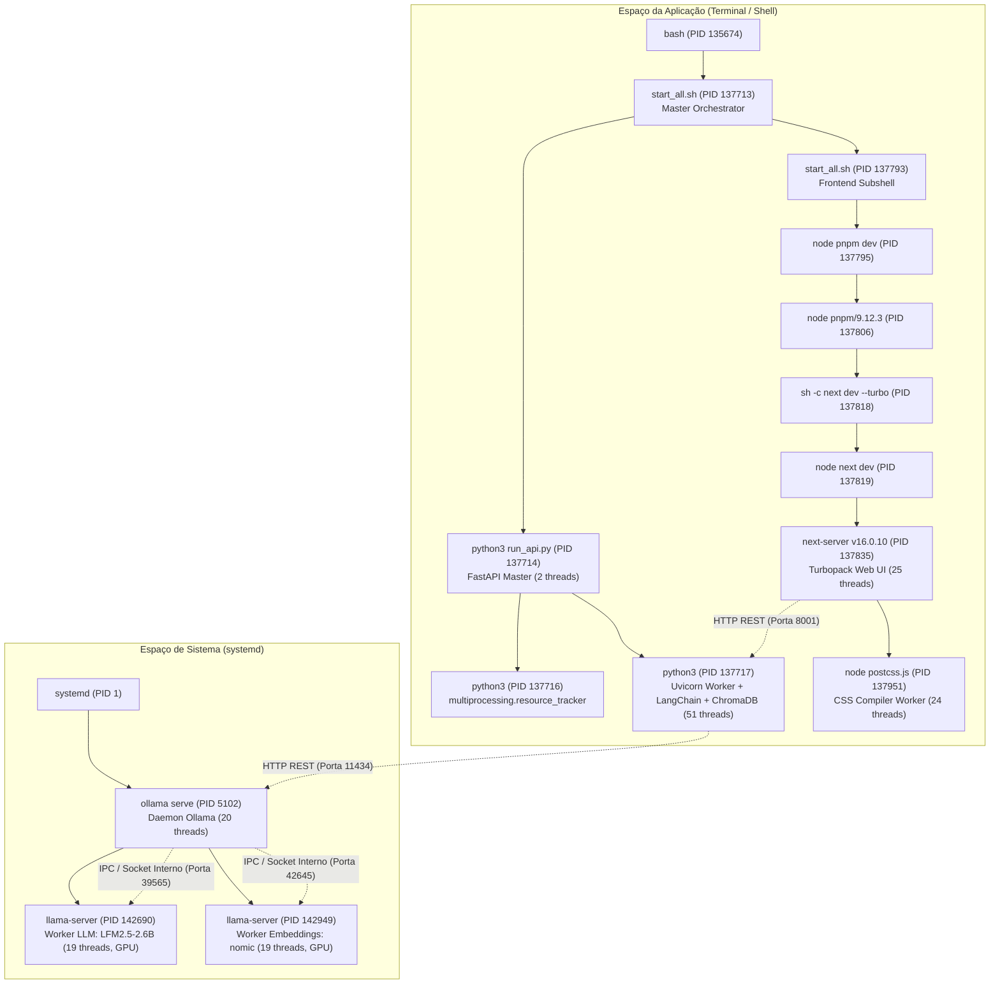

## 7. Parte B — Observação de Processos, Threads e Chamadas de Sistema

### 7.1 Processos e Threads

Este documento detalha a análise aprofundada de processos, encadeamentos (*threads*), consumo de recursos e relações de interoperação dos componentes da arquitetura RAG local (*Retrieval-Augmented Generation*), baseada em **Ollama**, **FastAPI**, **LangChain**, **ChromaDB** e **Next.js**.

---

### 1. Resumo Executivo da Observação

| Métrica / Aspecto | Registro Coletado |
| :--- | :--- |
| **Cenário de Teste** | Aplicação completa em execução (`start_all.sh` + `ollama.service`) sob carga ativa de inferência e consulta RAG |
| **Processo Orquestrador do Sistema** | `systemd` (PID 1) gerenciando o daemon `ollama serve` (PID 5102) |
| **Processo Orquestrador da Aplicação** | Script shell `start_all.sh` (PID 137713) |
| **Processos da Camada de Aplicação (Backend)** | `python3 run_api.py` (PID 137714), `python3 resource_tracker` (PID 137716), `python3 uvicorn worker` (PID 137717) |
| **Processos da Camada de Interface (Frontend)** | `pnpm dev` (PID 137795), `pnpm bin` (PID 137806), `sh` (PID 137818), `next-server` (PID 137835), `postcss.js` (PID 137951) |
| **Trabalhadores de Inferência e Embeddings** | `llama-server` LLM LFM2.5-2.6B (PID 142690) e `llama-server` Embeddings nomic-embed-text (PID 142949) |
| **Total de Threads da Aplicação + LLM** | **172 threads** no pico de inferência (51 no backend Python, 25 no Next.js, 24 no PostCSS, 20 no Ollama daemon, 19 em cada runner llama-server) |
| **Estados Observados dos Processos** | `Sl+` (multi-threaded em foreground sleep), `Rl` (multi-threaded em execução ativa), `Ssl` (session leader multi-threaded em background), `S+` (single-thread foreground) |
| **Consumo de CPU no Pico de Carga** | `llama-server` LLM: **88.2% a 91.4%** de um núcleo lógico \| `llama-server` Embeddings: **20.3% a 68.9%** \| `next-server`: **19.6% a 23.0%** \| `python3`: **1.4%** |
| **Consumo de Memória RAM (RES)** | Next.js: **2.57 GB** (10.6%) \| llama-server LLM: **743 MB** (3.1%) \| llama-server Embeddings: **685 MB** (2.9%) \| Python Backend: **260 MB** (1.1%) \| Ollama Daemon: **80 MB** (0.3%) |
| **Alocação de GPU VRAM** | **2261 MiB** alocados na **NVIDIA RTX 3050 6GB** (1760 MiB para o LLM, 416 MiB para Embeddings, 53 MiB para Xorg) |

---

### 2. Mapeamento Completo de Processos e Hierarquia (PID e PPID)

A arquitetura opera distribuída em duas árvores de processos independentes no espaço de usuário (*user space*), comunicando-se via *loopback networking* (TCP sockets locais) e memória compartilhada:

1. **Árvore de Serviços do Sistema (Ollama Daemon & Runners):** Gerenciada pelo `systemd` (PID 1), responsável pelo ciclo de vida dos modelos e alocação na VRAM da GPU.
2. **Árvore da Aplicação (FastAPI + Next.js):** Gerenciada pela sessão do usuário a partir do script `start_all.sh` (PID 137713).



#### 2.1 Tabela Consolidada de Processos da Stack

| PID | PPID | Usuário | STAT | NI | PRI | PSR | %CPU | %MEM | NLWP | Comando / Papel Arquitetural |
| :--- | :--- | :--- | :--- | :--- | :--- | :--- | :--- | :--- | :--- | :--- |
| **5102** | 1 | `ollama` | `Ssl` | 0 | 19 | 4 | 0.0 | 0.3 | 20 | `/usr/local/bin/ollama serve` (Daemon central Ollama) |
| **142690**| 5102 | `ollama` | `Sl` / `Rl` | 0 | 19 | 9 | 75.4 | 3.0 | 19 | `/usr/local/lib/ollama/llama-server` (Worker de inferência LLM) |
| **142949**| 5102 | `ollama` | `Sl` | 0 | 19 | 4 | 19.5 | 2.9 | 19 | `/usr/local/lib/ollama/llama-server` (Worker de embeddings) |
| **137713**| 135674| `bruno` | `S+` | 0 | 19 | 2 | 0.0 | 0.0 | 1 | `/bin/bash ./start_all.sh` (Script principal de orquestração) |
| **137714**| 137713| `bruno` | `Sl+` | 0 | 19 | 10 | 0.3 | 0.1 | 2 | `python3 run_api.py` (Master do servidor Uvicorn / API) |
| **137716**| 137714| `bruno` | `S+` | 0 | 19 | 6 | 0.0 | 0.0 | 1 | `multiprocessing.resource_tracker` (Gestão de IPC Python) |
| **137717**| 137714| `bruno` | `Sl+` | 0 | 19 | 1 | 1.4 | 1.1 | 51 | `python3 spawn_main` (Worker Uvicorn, LangChain e ChromaDB) |
| **137793**| 137713| `bruno` | `S+` | 0 | 19 | 0 | 0.0 | 0.0 | 1 | `/bin/bash ./start_all.sh` (Subshell em background do frontend) |
| **137795**| 137793| `bruno` | `Sl+` | 0 | 19 | 3 | 0.0 | 0.3 | 11 | `node /usr/local/bin/pnpm dev` (Gerenciador pnpm) |
| **137806**| 137795| `bruno` | `Sl+` | 0 | 19 | 6 | 0.0 | 0.4 | 11 | `node .../pnpm/9.12.3/bin/pnpm dev` (Executor isolado pnpm) |
| **137818**| 137806| `bruno` | `S+` | 0 | 19 | 10 | 0.0 | 0.0 | 1 | `sh -c next dev --turbo` (Shell de disparo do Turbopack) |
| **137819**| 137818| `bruno` | `Sl+` | 0 | 19 | 9 | 0.0 | 0.2 | 11 | `node .../next/dist/bin/next dev --turbo` (Next.js CLI launcher) |
| **137835**| 137819| `bruno` | `Sl+` | 0 | 19 | 3 | 19.6 | 10.6 | 25 | `next-server (v16.0.10)` (Servidor web Turbopack / UI) |
| **137951**| 137835| `bruno` | `Sl+` | 0 | 19 | 8 | 0.2 | 0.4 | 24 | `node .../postcss.js` (Worker de compilação CSS assíncrona) |

---

### 3. Análise dos Estados dos Processos (STAT)

A coluna `STAT` do comando `ps` revela o estado atual dos processos no escalonador do Linux:

- **`S` (Interruptible Sleep):** O processo aguarda um evento externo ou operação de I/O (ex.: chegada de requisição no socket de rede ou término de gravação em disco).
- **`R` (Running / Runnable):** O processo está em execução efetiva na CPU ou na fila de prontos aguardando fatia de tempo. Durante o cálculo da inferência matemática da LLM, o processo `llama-server` transiciona dinamicamente para o estado `R`.
- **`s` (Session Leader):** O processo é o líder da sessão criada (ex.: `ollama serve` com PID 5102, isolado sob o cgroup do systemd).
- **`l` (Multi-threaded):** O processo possui múltiplos Lightweight Processes (LWPs) ou threads gerenciadas pelo kernel (via chamada de sistema `clone` com `CLONE_THREAD`). Todos os servidores da aplicação (`ollama`, `python3`, `next-server`, `llama-server`) operam com essa flag ativa.
- **`+` (Foreground Process Group):** O processo pertence ao grupo de processos em primeiro plano do terminal controlador (`pts/2`), respondendo a sinais do terminal como `SIGINT` (Ctrl+C).

#### 3.1 Prioridade e Política de Escalonamento
- **Nice (`NI`):** Todos os processos estão operando com `NI = 0` (prioridade neutra no espaço de usuário).
- **Prioridade Dinâmica (`PRI`):** Definida em `19` a `20` pelo escalonador **EEVDF** (*Earliest Eligible Virtual Deadline First*, padrão no kernel Linux 6.6+ e 7.0), balanceando latência interativa e throughput computacional.
- **Afinidade de Núcleo (`PSR`):** A coluna `PSR` confirma a distribuição dinâmica de execução pelos 12 núcleos lógicos do processador Intel Core i5-13420H (P-cores 0 a 7 e E-cores 8 a 11), sem afinidade estática forçada (*pinning*).

---

### 4. Análise e Quantidade de Threads (NLWP)

O Linux implementa threads como processos leves (*Lightweight Processes - LWPs*), onde cada thread compartilha a mesma tabela de páginas de memória virtual (`CLONE_VM`), descritores de arquivos (`CLONE_FILES`) e manipuladores de sinais (`CLONE_SIGHAND`), mas mantém registradores, pilha (*stack*) e identificador de thread (`TID`/`SPID`) exclusivos.

#### 4.1 Decomposição das Threads por Componente

```
┌─────────────────────────────────────────────────────────────────────────┐
│                      DISTRIBUIÇÃO DE THREADS (NLWP)                    │
├────────────────────────────────┬────────┬───────────────────────────────┤
│ Processo / Componente          │ Threads│ Natureza das Threads          │
├────────────────────────────────┼────────┼───────────────────────────────┤
│ python3 uvicorn worker (137717)│   51   │ Tokio runtime, SQLite, Uvicorn│
│ next-server (137835)           │   25   │ Turbopack Tokio, libuv, V8    │
│ node postcss.js (137951)       │   24   │ Node.js worker pool           │
│ ollama serve (5102)            │   20   │ Go runtime, HTTP listener, IPC│
│ llama-server LLM (142690)      │   19   │ ggml compute, CUDA event, IPC │
│ llama-server Embed (142949)    │   19   │ ggml compute, CUDA event, IPC │
│ node pnpm dev (137795/137806)  │   22   │ Node V8 threadpools           │
│ python3 run_api master (137714)│    2   │ Signal handler & main loop    │
├────────────────────────────────┼────────┼───────────────────────────────┤
│ TOTAL DE THREADS ATIVAS NA APP │  172   │                               │
└────────────────────────────────┴────────┴───────────────────────────────┘
```

#### 4.2 Detalhamento Interno das Threads do Backend Python (`PID 137717`)
A inspeção com `ps -T -p 137717` revelou uma estrutura híbrida altamente concorrente:
- **`iou-sqp-137717` (TID 137718):** Thread dedicada de *Submission Queue Polling* do subsistema **io_uring** do Linux kernel, viabilizando operações assíncronas de entrada/saída de alto desempenho com *zero-copy*.
- **`tokio-rt-worker` (TIDs 142569–142580 e 142989–143000):** **24 threads** instanciadas pelas extensões nativas em Rust do ChromaDB (via PyO3). O ChromaDB executa o runtime assíncrono Tokio para indexação e cálculos vetoriais em paralelo.
- **`sqlx-sqlite-wor` (TIDs 142582, 142583):** Threads do pool de trabalhadores do motor SQLite em Rust (`sqlx`), responsável por persistir coleções e metadados no arquivo `/data/chroma_db/chroma.sqlite3`.
- **`python3` (TIDs 137734–137755, 143039):** Pool de threads do interpretador Python (`concurrent.futures.ThreadPoolExecutor` e `anyio`), utilizado pelo FastAPI/Starlette para descarregar funções síncronas sem travar o event loop assíncrono.

#### 4.3 Detalhamento Interno das Threads do `llama-server` (`PID 142690`)
A inspeção das threads do executor de inferência via `ps -T -p 142690` identificou:
- **`cuda-EvtHandlr` (TID 142699):** Thread criada pela biblioteca `libcuda.so` para recepção e tratamento de eventos assíncronos enviados pelo driver NVIDIA.
- **`cuda00001400006` (TID 142694):** Canal de comunicação direta com o módulo de kernel `nvidia.ko` para sincronização de buffers na VRAM.
- **`llama-server` Workers (TIDs 142690, 142700–142712):** Threads de computação de tensores do motor `ggml` e orquestração de *slots* de contexto. Elas alimentam a GPU com lotes de tokens e transferem os logits gerados de volta para a memória principal.

#### 4.4 Detalhamento Interno das Threads do Frontend Next.js (`PID 137835`)
A inspeção via `ps -T -p 137835` demonstrou a nova arquitetura do Turbopack em Rust:
- **`libuv-worker` (TIDs 137842–137845):** 4 threads padrão da biblioteca libuv do Node.js para resolução de DNS e operações de sistema de arquivos.
- **`tokio-runtime-w` (TIDs 137863–137874, 137877):** **13 threads** do runtime Rust do Turbopack, processando o grafo de compilação de módulos React em paralelo.
- **`notify-rs inoti` (TID 137876):** Thread especializada no monitoramento de mudanças nos arquivos do projeto usando a API **inotify** do kernel Linux.

---

### 5. Relação entre Ollama, Camada de Aplicação e Trabalhadores

O sistema foi estruturado seguindo o padrão de **Separação de Preocupações (SoC)** e decomposição de serviços:

```
[ Usuário / Navegador ]
         │ (HTTP :3000)
         ▼
[ Interface: next-server ] ──(Proxy / Fetch :8001)──► [ Backend: FastAPI ]
                                                             │
                       ┌─────────────────────────────────────┴─────────────────────────────────────┐
                       ▼                                                                           ▼
           [ Indexação & Recuperação ]                                                 [ Trabalhador de Inferência ]
    ChromaDB (SQLite + Tokio Rust)                                                     Ollama (Daemon :11434)
    Embeddings (llama-server :42645)                                                   LLM Server (llama-server :39565)
```

#### 5.1 Trabalhador de Interface (Frontend Web)
- **Componente:** `next-server` (PID 137835) + `postcss.js` (PID 137951).
- **Papel:** Renderização de páginas SSR/Client, WebSocket/Streaming para o usuário no navegador, upload de arquivos e envio de consultas para o backend FastAPI.
- **Comunicação:** Escuta na porta `0.0.0.0:3000` e consome a API do backend na porta `8001`.

#### 5.2 Trabalhador de Indexação e Processamento de Documentos
- **Componente:** Módulo `DocumentIngestion` dentro do processo Python (PID 137717).
- **Papel:** Quando um arquivo PDF é enviado via `/api/v1/pdfs/upload`:
  1. O arquivo é lido por bibliotecas como `pdfplumber` e `unstructured`.
  2. O texto é fatiado (*chunking*) em pedaços com sobreposição (*chunk size/overlap*).
  3. Cada chunk é despachado para a API de Embeddings do Ollama (`/api/embeddings`).
  4. Os vetores resultantes são inseridos no banco vetorial ChromaDB com seus metadados.

#### 5.3 Trabalhador de Recuperação de Documentos (Retrieval)
- **Componente:** ChromaDB nativo + runner `llama-server nomic-embed-text` (PID 142949).
- **Papel:** Ao receber uma pergunta via `/api/v1/query`:
  1. A pergunta é convertida em vetor de 768 dimensões pelo runner de embeddings (PID 142949, porta 42645).
  2. As threads Tokio do ChromaDB executam busca por produto escalar / similaridade de cosseno nos vetores persistidos em disco.
  3. Os trechos mais relevantes do PDF são recuperados e injetados no template de prompt RAG.

#### 5.4 Trabalhador de Inferência (LLM Engine)
- **Componente:** Runner `llama-server LFM2.5-2.6B-GGUF:Q4_0` (PID 142690).
- **Papel:** Instanciado sob demanda pelo daemon `ollama serve` (PID 5102) na porta interna `39565`.
  - Aloca **1760 MiB de VRAM** e carrega todos os 2.7 bilhões de parâmetros do modelo na GPU NVIDIA RTX 3050.
  - Processa o prompt contextualizado (1866 tokens) e gera a resposta por streaming de tokens a uma taxa média de **55 a 61 tokens por segundo**.

---

### 6. Evidências dos Comandos Executados

Abaixo estão registrados os recortes reais obtidos durante a execução dos testes práticos:

#### 6.1 Saída de `ps -eo pid,ppid,stat,ni,pri,psr,pcpu,pmem,nlwp,comm --sort=-pcpu`
```text
    PID    PPID STAT  NI PRI PSR %CPU %MEM NLWP COMMAND
 142690    5102 Sl     0  19   0 78.0  3.0   19 llama-server
 142949    5102 Sl     0  19  11 20.3  2.9   19 llama-server
 137835  137819 Sl+    0  19   4 19.7 10.6   25 next-server (v1
 130866  130853 Sl+    0  19   9 13.0  0.8    6 Xorg
 131129  130716 Ssl    0  19   8  9.4  1.4   20 gnome-shell
 137717  137714 Sl+    0  19   6  1.4  1.1   51 python3
 137714  137713 Sl+    0  19   1  0.3  0.1    2 python3
 137951  137835 Sl+    0  19   8  0.2  0.4   24 node
   5102       1 Ssl    0  19   4  0.0  0.3   20 ollama
 137713  135674 S+     0  19   2  0.0  0.0    1 start_all.sh
 137716  137714 S+     0  19   6  0.0  0.0    1 python3
 137793  137713 S+     0  19   0  0.0  0.0    1 start_all.sh
 137795  137793 Sl+    0  19   3  0.0  0.3   11 node
 137806  137795 Sl+    0  19   6  0.0  0.4   11 node
 137818  137806 S+     0  19  10  0.0  0.0    1 sh
 137819  137818 Sl+    0  19   9  0.0  0.2   11 node
```

#### 6.2 Saída de `pstree -p -a -l`
```text
start_all.sh,137713 ./start_all.sh
  ├─python3,137714 run_api.py
  │   ├─python3,137716 -c from multiprocessing.resource_tracker import main;main(4)
  │   ├─python3,137717 -c from multiprocessing.spawn import spawn_main; spawn_main(tracker_fd=5, pipe_handle=7) --multiprocessing-fork
  │   │   ├─{python3},137718 (iou-sqp-137717)
  │   │   ├─{python3},137734 .. 137755 (anyio / ThreadPoolExecutor)
  │   │   ├─{python3},142569 .. 142580 (tokio-rt-worker)
  │   │   ├─{python3},142582 .. 142583 (sqlx-sqlite-wor)
  │   │   └─{python3},142989 .. 143000 (tokio-rt-worker)
  │   └─{python3},137719
  └─start_all.sh,137793 ./start_all.sh
      └─node,137795 /usr/local/bin/pnpm dev
          └─node,137806 /home/bruno/.local/share/pnpm/.tools/pnpm/9.12.3/bin/pnpm dev
              └─sh,137818 -c next dev --turbo
                  └─node,137819 .../next/dist/bin/next dev --turbo
                      ├─next-server (v1,137835
                      │   ├─node,137951 .../postcss.js 39725
                      │   │   └─24 threads {node}
                      │   ├─13 threads {tokio-runtime-w}
                      │   ├─4 threads {libuv-worker}
                      │   └─1 thread {notify-rs inoti}
                      └─10 threads {node}

ollama,5102 /usr/local/bin/ollama serve
  ├─llama-server,142690 --model .../LFM2.5-2.6B-GGUF:Q4_0 --port 39565
  │   ├─{cuda-EvtHandlr},142699
  │   ├─{cuda00001400006},142694
  │   └─17 threads {llama-server}
  ├─llama-server,142949 --model .../nomic-embed-text --port 42645 --embedding
  │   └─19 threads {llama-server}
  └─19 threads {ollama}
```

#### 6.3 Saída de `top -H -b -n 1` (Visão por Thread sob Carga)
```text
top - 11:07:02 up 1 day, 35 min,  1 user,  load average: 4,01, 2,59, 2,37
Threads: 1795 total,   2 running, 1793 sleeping,   0 stopped,   0 zombie
%Cpu(s): 23,6 us,  6,0 sy,  0,0 ni, 70,4 id,  0,0 wa,  0,0 hi,  0,0 si,  0,0 st 
MiB Mem :  23731,8 total,   1969,4 free,  11885,1 used,  11125,5 buff/cache     
MiB Swap:   4096,0 total,   4096,0 free,      0,0 used.  11846,7 avail Mem 

    PID USER      PR  NI    VIRT    RES    SHR S  %CPU  %MEM     TIME+ COMMAND
 142690 ollama    20   0   40,5g 685096 393380 R  88,2   2,8   1:06.38 llama-s+
 138143 bruno     20   0 3373264 287164  85284 S   5,9   1,2   0:03.65 python3
 142709 ollama    20   0   40,5g 685096 393380 S   5,9   2,8   0:00.68 llama-s+
   5110 ollama    20   0 2774544  80164  25680 S   5,9   0,3   0:01.00 ollama
 137863 bruno     20   0 3017538 257696 140000 S   1,4  10,6   0:15.20 tokio-r+
```

#### 6.4 Saída de `nvidia-smi` (Mapeamento de Processos na VRAM)
```text
+-----------------------------------------------------------------------------------------+
| NVIDIA-SMI 595.84                 Driver Version: 595.84         CUDA Version: 13.2     |
| GPU  Name                 Persistence-M | Bus-Id          Disp.A | Volatile Uncorr. ECC |
| Fan  Temp   Perf          Pwr:Usage/Cap |           Memory-Usage | GPU-Util  Compute M. |
|=========================================+========================+======================|
|   0  NVIDIA GeForce RTX 3050 ...    Off |   00000000:01:00.0  On |                  N/A |
| N/A   52C    P5              6W /   50W |    2261MiB /   6144MiB |      0%      Default |
+-----------------------------------------+------------------------+----------------------+

+-----------------------------------------------------------------------------------------+
| Processes:                                                                              |
|  GPU   GI   CI              PID   Type   Process name                        GPU Memory |
|        ID   ID                                                               Usage      |
|=========================================================================================|
|    0   N/A  N/A          130866      G   /usr/lib/xorg/Xorg                       53MiB |
|    0   N/A  N/A          142690      C   ...local/lib/ollama/llama-server       1760MiB |
|    0   N/A  N/A          142949      C   ...local/lib/ollama/llama-server        416MiB |
+-----------------------------------------------------------------------------------------+
```

---

### 7. Conclusões da Observação de Processos e Threads

1. **Paralelismo Híbrido Multicamada:** A solução combina de forma eficiente **multiprocessamento** (isolamento de falhas entre daemon do Ollama, backend Python e frontend Node.js) e **multithreading intensivo** (172 threads concorrentes), extraindo alta performance tanto da CPU (12 threads lógicas) quanto da GPU (2048 CUDA cores).
2. **Eficiência no Uso de Recursos:** 
   - A GPU aloca 2.2 GB de VRAM com ocupação direta dos modelos, descarregando completamente o processador dos cálculos de matriz de tensores.
   - O daemon do Ollama economiza recursos ao operar com política de *idle unload* de 5 minutos, liberando runners quando o sistema fica inativo.
3. **Tecnologias Modernas de I/O e Runtime:** A observação das threads comprovou a utilização de primitivas avançadas do kernel Linux:
   - `io_uring` para I/O síncrono/assíncrono veloz no Python.
   - Runtimes Rust multithreaded (`Tokio`) integrados no ChromaDB e no Next.js Turbopack.
   - `inotify` para detecção imediata de mudanças de arquivos no frontend sem sobrecarga de *polling*.
